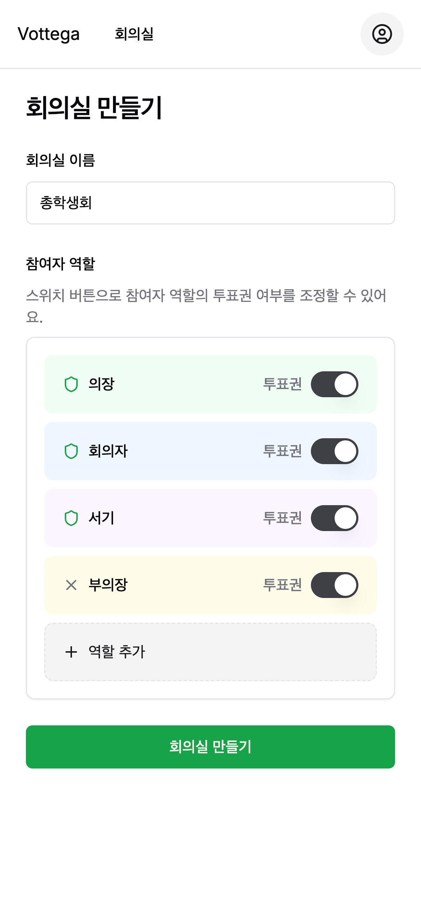
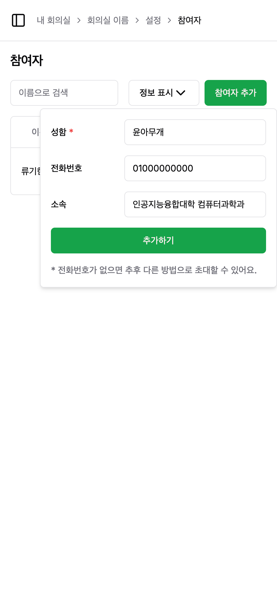
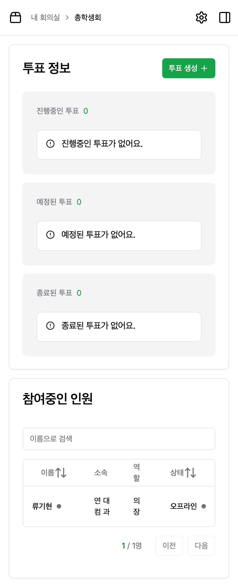
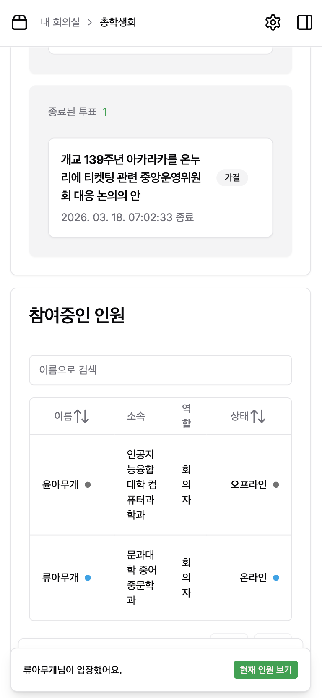
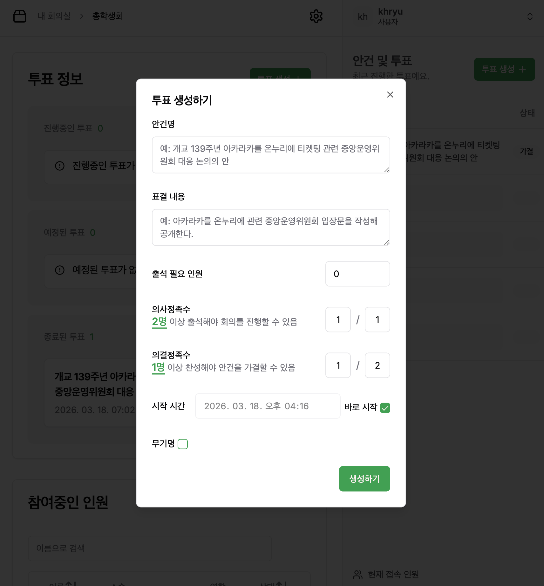
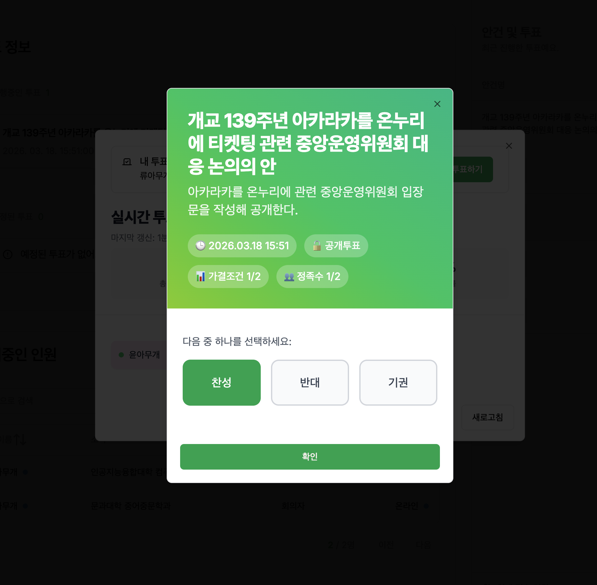
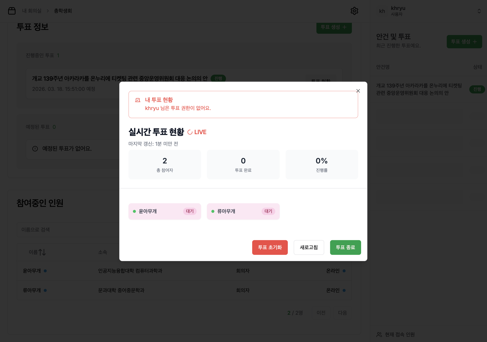
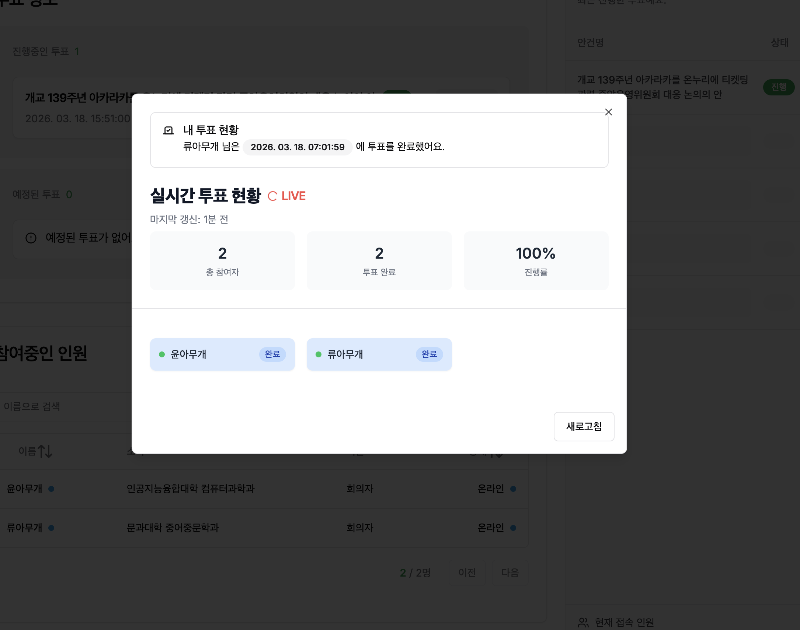
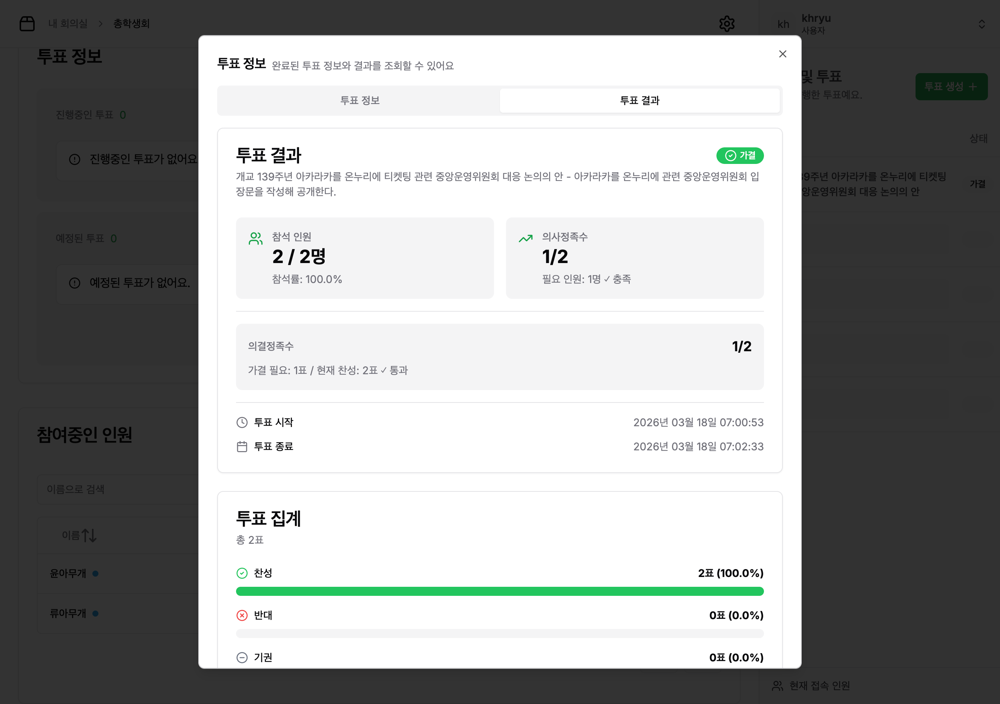

# Vottega — 실시간 의결 투표 플랫폼 (Client)

> 총학생회 회의에서 거수로 투표하던 비효율을 없애기 위해 만든, 의사정족수·의결정족수를 지원하는 실시간 투표 시스템의 프론트엔드입니다.

## 스크린샷

### 1. 회의실 생성 — 역할별 투표권 설정



회의실을 만들 때 참여자 역할(의장, 회의자, 서기 등)을 정의하고 역할별 투표권을 설정합니다.

### 2. 참여자 추가



설정 페이지에서 참여자를 추가합니다. 추가된 참여자에게 초대 링크를 전달하면 별도 회원가입 없이 입장할 수 있습니다.

### 3. 회의실 상세 — 투표 현황 + 참여자 목록



진행중·예정·종료 투표를 한눈에 볼 수 있고, 하단에서 참여 인원의 입장 상태를 확인합니다.

### 4. 실시간 알림 (SSE)



참여자 입장 등 실시간 이벤트가 발생하면 SSE를 통해 실시간으로 토스트 알림이 뜨고, 참여자 목록이 자동 업데이트됩니다.

- 참여자 입장/퇴장
- 투표 생성/수정/시작/종료
- 투표용지 제출

### 5. 투표 생성 — 의사정족수·의결정족수 설정



안건명, 표결 내용, 정족수 조건, 시작 시간, 무기명 여부를 설정하여 투표를 생성합니다.

### 6. 투표 용지 — 참여자 시점



참여자에게 보이는 투표 화면입니다. 안건 정보와 정족수 조건을 확인한 뒤 찬성/반대/기권 중 하나를 선택합니다.

### 7. 실시간 투표 현황판 — 방장 시점



방장은 투표 권한이 없는 경우에도 실시간으로 투표 진행률과 참여자별 투표 상태(대기/완료)를 확인할 수 있습니다.

### 8. 투표 완료 — 진행률 100%



모든 참여자의 투표가 완료되면 진행률이 100%로 표시됩니다.

### 9. 투표 결과 — 정족수 충족 여부 판정



투표 종료 후 참석 인원, 의사정족수 충족 여부, 의결정족수 충족 여부, 찬성/반대/기권 비율을 종합하여 가결·부결을 판정합니다.

---

## 목차

- [스크린샷](#스크린샷)
- [문제 정의](#문제-정의)
- [핵심 기능](#핵심-기능)
- [기술 스택과 선택 이유](#기술-스택과-선택-이유)
- [아키텍처](#아키텍처)
  - [실시간 데이터 동기화: SSE + 타임스탬프 이중 검증](#실시간-데이터-동기화-sse--타임스탬프-이중-검증)
  - [서버 상태 단일 소스: React Query 캐시 직접 조작](#서버-상태-단일-소스-react-query-캐시-직접-조작)
  - [이중 인증 모델: 방장(USER)과 참여자(PARTICIPANT)](#이중-인증-모델-방장user과-참여자participant)
- [프로젝트 구조](#프로젝트-구조)
- [시작하기](#시작하기)
- [코드에서 봐야 할 포인트](#코드에서-봐야-할-포인트)
- [향후 계획](#향후-계획)
- [관련 레포지토리](#관련-레포지토리)

---

## 문제 정의

학교 총학생회 회의에서 투표를 진행할 때마다 반복되는 문제가 있었습니다:

1. **거수 투표의 부정확성** — 참석자가 많으면 수를 세기 어렵고, 실수가 생김
2. **정족수 판단의 번거로움** — 의사정족수(회의 성립 조건)와 의결정족수(안건 통과 조건)를 매번 수동 계산
3. **투표 현황 파악 불가** — 누가 투표했는지, 실시간 진행률이 얼마인지 알 수 없음
4. **비밀투표 불가** — 거수는 구조적으로 공개 투표라 민감한 안건에 부적합

Vottega는 이 문제를 해결합니다. 방장이 회의실을 만들고, 참여자를 초대하고, 안건별 투표를 생성하면 — 참여자는 링크 하나로 입장해서 실시간으로 투표에 참여합니다.

---

## 핵심 기능

| 기능                    | 설명                                                            |
| ----------------------- | --------------------------------------------------------------- |
| **회의실 관리**         | 회의실 생성·시작·종료, 참여자 초대, 역할(Role) 기반 권한 관리   |
| **의회식 투표**         | 의사정족수·의결정족수 설정, 찬성/반대/기권 투표, 공개·비밀 투표 |
| **실시간 동기화**       | SSE 기반 투표 진행률·참여자 입장·투표 결과 실시간 반영          |
| **초대 링크 입장**      | `/join/:uuid` 링크로 참여자가 별도 회원가입 없이 입장           |
| **투표 현황판**         | 실시간 투표 진행 상황, 참여율, 결과를 한눈에 확인               |
| **역할 기반 접근 제어** | 방장(USER)과 참여자(PARTICIPANT)의 권한 분리                    |

---

## 기술 스택과 선택 이유

| 영역            | 기술                                  | 선택 이유                                                                                                                                                                                    |
| --------------- | ------------------------------------- | -------------------------------------------------------------------------------------------------------------------------------------------------------------------------------------------- |
| **프레임워크**  | React 18 + TypeScript                 | 타입 안전성 기반의 컴포넌트 설계. Discriminated Union 패턴으로 SSE 이벤트·인증 상태를 컴파일 타임에 검증                                                                                     |
| **빌드**        | Vite                                  | 빠른 HMR과 번들링. SPA로 충분한 요구사항에 Next.js의 SSR은 불필요                                                                                                                            |
| **서버 상태**   | TanStack React Query v5               | 별도 상태관리 라이브러리 없이 서버 상태를 단일 소스로 관리. SSE 이벤트로 캐시를 직접 조작하여 refetch 없이 실시간 반영                                                                       |
| **실시간 통신** | SSE (`@microsoft/fetch-event-source`) | 클라이언트→서버 통신은 REST로 충분하고, 서버→클라이언트 단방향 푸시만 필요. WebSocket의 양방향 채널은 오버스펙. `fetch-event-source`는 네이티브 `EventSource`와 달리 커스텀 헤더(JWT)를 지원 |
| **폼**          | react-hook-form + Zod                 | Zod 스키마를 API DTO 타입과 폼 검증에 공유하여 이중 정의 방지                                                                                                                                |
| **UI**          | shadcn/ui + Radix + Tailwind CSS      | 접근성이 보장된 Headless UI 위에 디자인 토큰을 입힘. 복사 방식이라 커스터마이징 자유도 확보                                                                                                  |
| **HTTP**        | Axios                                 | 인터셉터 기반 토큰 주입·에러 변환의 중앙 집중 처리                                                                                                                                           |

---

## 아키텍처

### 실시간 데이터 동기화: SSE + 타임스탬프 이중 검증

가장 많이 고민한 부분입니다. SSE 이벤트와 REST 응답이 공존하는 환경에서 **데이터 정합성**을 어떻게 보장할 것인가?

**문제:** 사용자가 REST로 투표를 수정한 직후, 수정 전 상태의 SSE 이벤트가 도착하면 캐시가 이전 상태로 롤백됩니다.

**해결: 2단계 타임스탬프 검증**

```
SSE 이벤트 수신
    │
    ▼
[1단계] shouldProcessEvent()
    │  현재 캐시의 lastUpdatedAt vs 이벤트의 lastUpdatedAt 비교
    │  → 오래된 이벤트면 즉시 무시
    │
    ▼
[2단계] setQueryData() 콜백 내부
    │  캐시 업데이트 직전에 한 번 더 타임스탬프 비교
    │  → 1단계와 2단계 사이에 다른 업데이트가 끼어도 안전
    │
    ▼
캐시 업데이트 완료 → UI 자동 리렌더
```

1단계만으로는 부족합니다. `shouldProcessEvent()`를 통과한 뒤, `setQueryData()` 콜백이 실행되기 전에 다른 REST 응답이 캐시를 업데이트할 수 있기 때문입니다. 2단계에서 콜백 내부의 최신 캐시 값과 다시 비교하여 **race condition을 완전히 차단**합니다.

이 패턴은 4개 이벤트 핸들러(`useVoteEventHandler`, `useParticipantEventHandler`, `useRoomInfoEventHandler`, `useVotePaperEventHandler`)에 일관되게 적용됩니다.

> 📂 관련 코드: `src/hooks/useVoteEventHandler.ts`, `src/hooks/useParticipantEventHandler.ts`, `src/lib/utils.ts`의 `isNewerOrEqual()`

---

### 서버 상태 단일 소스: React Query 캐시 직접 조작

Redux, Zustand 같은 클라이언트 상태 라이브러리를 **의도적으로 사용하지 않았습니다.**

이 앱의 상태는 거의 전부가 서버 데이터(회의실 정보, 참여자 목록, 투표 목록)입니다. 서버 상태를 별도 store에 복제하면 **두 곳의 데이터 동기화**라는 새로운 문제가 생깁니다. 대신:

- **React Query 캐시가 유일한 진실의 원천(Single Source of Truth)**
- SSE 이벤트 → `queryClient.setQueryData()`로 캐시를 직접 수정 → UI가 자동으로 반영
- REST 뮤테이션 → `onSuccess`에서 캐시 업데이트 또는 `invalidateQueries()` 호출
- 컴포넌트 로컬 상태(`useState`)는 다이얼로그 열림/닫힘, 선택 옵션 등 순수 UI 상태에만 사용

이 구조에서는 "서버 데이터가 현재 어디에 있는가?"라는 질문에 항상 "React Query 캐시"라고 답할 수 있습니다.

---

### 이중 인증 모델: 방장(USER)과 참여자(PARTICIPANT)

두 종류의 사용자가 완전히 다른 인증 경로를 거칩니다:

- **방장(USER):** ID + 패스워드로 로그인 → JWT 발급 → 모든 회의실 접근 가능
- **참여자(PARTICIPANT):** 초대 링크(`/join/:uuid`)로 입장 → participantId 기반 JWT 발급 → 해당 회의실만 접근 가능

이를 타입 안전하게 처리하기 위해 **3계층 Auth Context**를 설계했습니다:

1. `AuthContext` — 원시 상태: `NOT_MOUNTED | NOT_AUTHENTICATED | VERIFYING | AuthContextValue`
2. `AuthenticatedAuthContext` — `AuthGuard` 내부에서만 제공되는, 인증 보장된 컨텍스트
3. 역할별 훅: `useUserAuth()`, `useParticipantAuth()`, `useMe()`

`NOT_AUTHENTICATED`와 `VERIFYING`을 Symbol로 분리하여, "아직 확인 중" vs "확인했는데 미인증"을 구분합니다. 이 덕분에 `AuthGuard`가 로딩 상태에서 잘못된 리다이렉트를 하지 않습니다.

> 📂 관련 코드: `src/lib/auth/AuthContext.tsx`, `src/lib/auth/AuthGuard.tsx`, `src/routes/ProtectedRoute.tsx`

---

## 프로젝트 구조

```
src/
├── components/
│   ├── ui/             # shadcn/ui 기반 공통 UI 프리미티브 (Button, Dialog, Card...)
│   ├── layouts/        # 레이아웃 컴포넌트 (AppLayout)
│   ├── Vote*.tsx       # 투표 도메인 컴포넌트 (Form, Card, LiveBoard, Result...)
│   ├── Room*.tsx       # 회의실 도메인 컴포넌트
│   └── Participant*.tsx # 참여자 도메인 컴포넌트
├── hooks/              # 커스텀 훅
│   ├── useRoomEventFetchSource.ts   # SSE 연결 관리 (단일 진입점)
│   ├── use*EventHandler.ts          # SSE 이벤트별 캐시 업데이트 로직
│   ├── useVotePermission.ts         # 투표 권한 판단
│   └── useDialog.vote.tsx           # 투표 다이얼로그 상태
├── lib/
│   ├── api/
│   │   ├── client.ts    # Axios 인스턴스 (인터셉터 기반 토큰 주입·에러 변환)
│   │   ├── endpoints.ts # Endpoint 클래스 기반 URL 관리
│   │   ├── errors.ts    # HttpError 클래스 (시맨틱 에러 분류)
│   │   ├── queries/     # React Query 쿼리 키·훅 정의
│   │   └── types/       # API DTO 타입 + Zod 스키마
│   └── auth/            # 3계층 Auth Context, AuthGuard, 토큰 관리
├── pages/               # 라우트별 페이지 (얇은 조합 레이어)
└── routes/              # ProtectedRoute, 역할 기반 접근 제어
```

---

## 시작하기

### 사전 요구사항

- Node.js ≥ 18
- pnpm

### 설치 및 실행

```bash
# 의존성 설치
pnpm install

# 개발 서버 실행
pnpm dev
```

http://localhost:5173 에서 확인할 수 있습니다.

백엔드 API 서버가 필요합니다. 기본적으로 `http://localhost:9000`의 `/api` 경로로 프록시됩니다.
환경 변수 `VITE_SERVER_HOST`로 백엔드 주소를 변경할 수 있습니다.

### 빌드

```bash
pnpm build     # TypeScript 컴파일 + Vite 번들링
pnpm preview   # 프로덕션 빌드 로컬 미리보기
```

---

## 코드에서 봐야 할 포인트

| 📍 위치                                | 무엇을                                  | 왜                                                                     |
| -------------------------------------- | --------------------------------------- | ---------------------------------------------------------------------- |
| `src/hooks/useVoteEventHandler.ts`     | 타임스탬프 이중 검증 패턴               | SSE와 REST 간 race condition을 한 파일 안에서 완결적으로 처리          |
| `src/hooks/useRoomEventFetchSource.ts` | Discriminated Union + exhaustive switch | TypeScript의 타입 시스템으로 SSE 이벤트 누락을 컴파일 타임에 검출      |
| `src/lib/auth/AuthContext.tsx`         | Symbol 기반 인증 상태 분리              | `null` 대신 Sentinel Symbol로 "미확인"과 "미인증"을 구분하는 패턴      |
| `src/lib/api/errors.ts`                | HttpError 시맨틱 분류                   | Axios 에러를 의미 있는 메서드(`isForbidden()`, `isConflict()`)로 변환  |
| `src/routes/ProtectedRoute.tsx`        | 선언적 역할 기반 라우팅                 | `allow` 함수와 `redirectTo` 함수로 역할별 접근 제어를 설정 형태로 표현 |

---

## 향후 계획

- **실시간 속기 기능** — 회의 중 안건별 발언 내용을 실시간으로 기록
- **회의록 PDF 내보내기** — 투표 결과 + 속기 내용을 공식 회의록 형태로 출력

---

## 관련 레포지토리

이 프로젝트는 MSA(마이크로서비스 아키텍처) 기반의 백엔드와 함께 동작합니다.

- 🏠 [vottega organization](https://github.com/vottega)

---

## 기여

2인 팀 프로젝트로, **프론트엔드 전체**를 담당했습니다.

- 프론트엔드 아키텍처 설계 및 전체 구현
- SSE 기반 실시간 동기화 설계
- 이중 인증 모델 및 역할 기반 접근 제어
- UI/UX 설계 및 컴포넌트 구현
